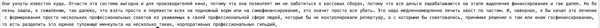

# Motivation
Speech Recognition (ASR) systems usually output unpunctuated and uncased texts (transcripts). The punctuation restoration improves the readability of ASR transcripts.

This work is about punctuation restoration for **the Russian language**. 
  
As a backbone approach, it's used [BertPunc](https://github.com/nkrnrnk/BertPunc) project. It's the state-of-the-art approach for English language punctuation restoration (at the time of publication).

As a backbone Transformer-based model, it's used [DeepPavlov/rubert-base-cased-sentence](https://huggingface.co/DeepPavlov/rubert-base-cased-sentence).

The supported punctuation signs: **period, comma, and question.**

# New made things with the comparison with [BertPunc](https://github.com/nkrnrnk/BertPunc):
+ direct decoding (to get human-readable transcript)
+ use embeddings from Transformer-based encoder layers instead of use LM logits (to decrease dimension in front of FC)

Please, don't hesitate to reach me if you have some questions or suggestions.

# Web App
## How you can launch (up to you)
1. `bash bin/build_run_container.sh <USED PORT> <CONTAINER NAME>` 
2. `bash flask_app_launch.sh <USED PORT>`
3. `flask run` (this choice uses default 5000 port)
## How to send requests
```http request
POST http://0.0.0.0:5000/predict
Content-Type: application/json # in Python requsets package it corresponds to request.content_type

{
  "corpus":
  [
    "привет как дела",
    "здравствуйте как обратиться в поддержку ну знаете беда случилась закончились средства а нужно восстановить подписку как быть что делать"
  ]
}
```
And response will look like:
```json
{
  "output": [
    "Привет. Как дела?",
    "Здравствуйте. Как обратиться в поддержку. Ну, знаете, беда случилась, закончились средства, а нужно восстановить подписку. Как быть, что делать?"
  ]
}
```
# Repository structure

------------------------
```
    .
    ├── bin
        ├── build_run_container.sh   <- build and run container
        ├── flask_app_launch.sh      <- run flask web app
        ├── run_container.sh         <- run container (when you have already built contariner)
    ├── checkpoints          <- folder to keep experiments artifacts
    ├── datasets             <- folder to keep train/valid/test datasets
    ├── results              <- folder with results reports
    ├── web_app              <- web app package
    ├── base.py              <- auxiliary functions: initialize random seed, device choice 
    ├── .dockerignore        
    ├── .flaskenv
    ├── .gitignore
    ├── data.py              <- make target, prepare datasets for training
    ├── dockerd-entrypoint.sh
    ├── Dockerfile
    ├── inference.py         <- perfom punctuation restored transcripts
    ├── make_datasets.py     <- make labeled tokens
    ├── model.py             <- form model architecture 
    ├── train.py             <- train-eval loop 
    ├── tests.py             <- unit tests (TODO)
    ├── requests.http        <- set of http-requests. It's useful to use in Pycharm 
    ├── requirements.txt     <- packages and libraries requirements 
    ├── web_app_run.py       <- .py script to launch Flask web app
    └── README.md
```

##  Dataset preparing
1. For model training, it's used radio dialogues data (provided by [link](https://github.com/vadimkantorov/convasr))

2. The script `make_datasets.py`:
    + takes raw or preprocessed text corpus
    + splits on *train/valid/test*
    + transforms every splits to format:
    
    
    
(if after token there is a period, comma, or question sign then the token is annotated with the corresponding label)
       
4. Dataset stats:
+ Train  - 6 761 752 annotated tokens
+ Valid  - 2 135 743 annotated tokens
+ Test - 116 853 annotated tokens


## Modeling
Used hyperparameters you can find in *checkpoints* folder.

### Metrics values on the validation dataset
 

### Metrics values on test dataset by best validation loss checkpoint


## Let's see how it restores data transcripts:

+ Example input from test data:
[  ](.README_images/2.png )


+ Punctuation and casing restored: 
[  ](.README_images/3.png )


+ Ideal GT:
[  ](.README_images/4.png )


## Let's see how it restores non-domain data (zero-shot learning)
It will be a medical text example (provided by [N.N. Burdenko Neurosurgery National Medical Research Center](https://www.nsi.ru/)) 
+ Example input:
[  ](.README_images/7.png )

+ Punctuation and casing restored: 
[  ](.README_images/8.png )


+ Ideal GT:
[  ](.README_images/9.png )


### See how it looks when it was fine-tuned on Russian medical abstracts of ["РИНЦ"](https://elibrary.ru/) papers
This data also was provided by  [N.N. Burdenko Neurosurgery National Medical Research Center](https://www.nsi.ru/)

**See results/comparison_results_table.xlsx**